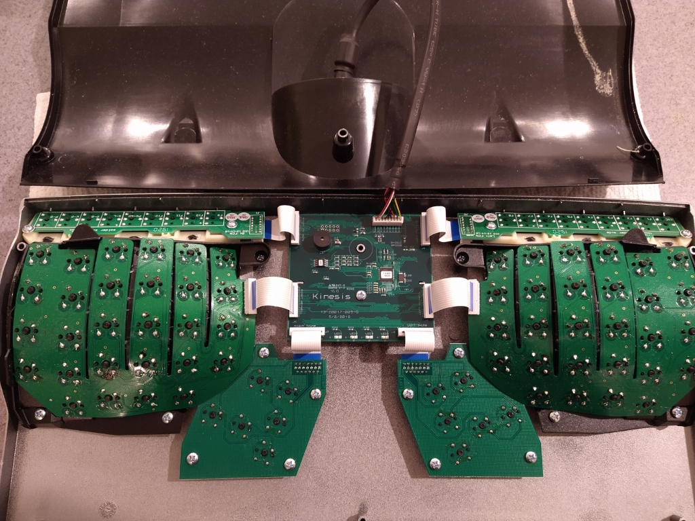
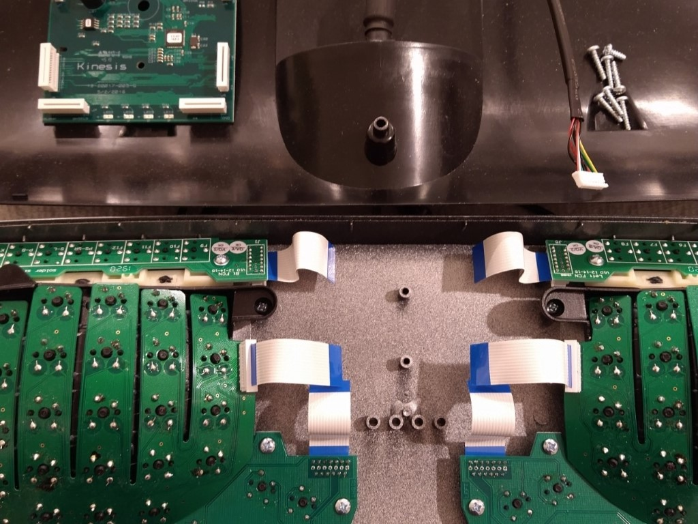
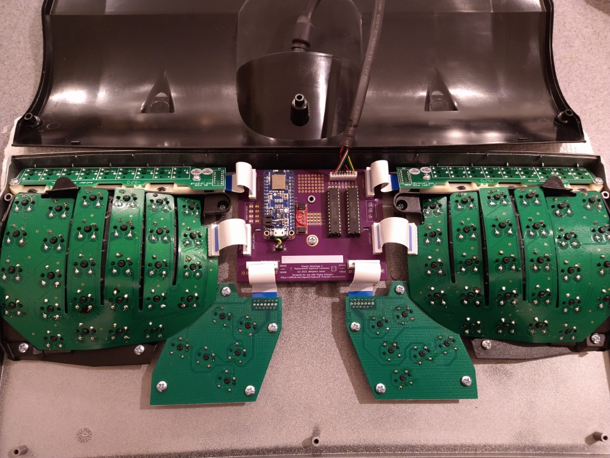

The kinT-QT keyboard controller is a replacement for your Kinesis Advantage or
Advantage 2 ergonomic keyboards.

It is based on the [kin-T controller](https://github.com/kinx-project/kint)
designed by Michael Stapelberg, which utilizes the line of Teensy
microcontrollers from PJRC.

kinT-QT is designed to be microcontroller-agnostic ... the matrix and
indicator LEDs to a pair of MCP23017 port expanders that are accessible via I2C,
so all of the functionality of the keyboard can be controlled by most microcontrollers
with 2 digital pins.

The PCB has footprints for [Adafruit Feather](https://www.adafruit.com/category/946)
boards, as well as for [Adafruit KB2040](https://adafru.it/5302) and other Pro Micro
compatibles. Connections from the microcontroller footprint to the I2C bus and
USB cable are configurable by solder jumpers, and extra prototyping space is provided
to allow for maximum flexibility.

## Quick overview

<table border="0" width="100%">
<tr>
<td width="33%">

3D render (front, LEDs)
</td>
<td width="33%">

3D render (back, components)
</td>
<td width="33%">

schematic
</td>
</tr>
</table>

## Compatibility

### Keyboards

The kint-QT keyboard controller was made for the Kinesis Advantage or Advantage 2
series.

The kinT-QT keyboard controller is not compatible with the newer Kinesis Advantage
360 series, introduced in 2022, because the 360 is a split keyboard that uses an
entirely different form factor for its electronics ([Kinesis 360 teardown
photos](https://photos.app.goo.gl/BwgzHgaTz1RKBjqc6)).

The kinT-QT keyboard controller is also not compatible with **very old Advantage**
keyboards, where the left and right keywell circuit boards plug directly into
the controller. See [issue #42](https://github.com/kinx-project/kint/issues/42)
for details and pictures.

### Microcontrollers & Development Boards

The above firmware has been tested with the following microcontroller development boards:

 * Adafruit Feather M0 Express
 * Adafruit Feather M4 Express
 * Adafruit Feather nRF52840 Express
 * Adafruit Feather RP2040
 * Adafruit KB2040

### Configurations

The kint-QT controller is designed to

## Building your own kinT-QT keyboard controller

1. Follow [“Buying the board and components (Bill of
   materials)”](https://github.com/bgould/kint-qt#buying-the-board-and-components-bill-of-materials).

1. Wait for the components to arrive. When ordering from big shops like Digi-Key
   or Mouser, this typically takes 2 days to many places in the world.

1. Wait for the boards to arrive. This takes 6 days in the best case when
   ordering from OSH Park with their Super Swift Service option. In general, the
   longer you are willing to wait, the cheaper it is going to get.

1. Follow [the soldering
   guide](https://github.com/bgould/kint-qt#soldering). This will take about
   an hour.

1. [Install the firmware](https://github.com/bgould/kint-qt#installing-the-firmware)

## Installing the kinT-QT replacement controller in your Kinesis keyboard

There are six Phillips #2 screws in the underside of the keyboard. Remove these
and open up the keyboard like a clam shell from the bottom. Detach the USB cable
from the Kinesis controller and remove the center screw. Carefully unlatch each 
of the white connectors and slide out the FFC ribbons. Remove the stock controller
while taking care not to snag or damage the ribbon cables. Slide the new board
into place, re-attach the center screw, and then re-seat all of the ribbon cables
and latch the connectors.

<table border="0" width="100%">
<tr>
<td width="33%">

KB600 with stock controller still installed and USB cable connected
</td>
<td width="33%">

KB600 with stock controller removed and USB cable disconnected
</td>
<td width="33%">

KB600 with kinT-QT installed and USB cable connected
</td>
</tr>
</table>

If you are going to continue to use the stock USB cable, plug it into the
connector at the top of the kinT-QT board. Carefully close the clam shell back
up, keeping an eye on the USB cable to make sure it doesn't get caught on one
of the ribbon cables. Replace the six screws (do not force them or tighten too
hard because they threaded into the plastic case).

Another way is to remove the existing cable from the Kinesis keyboard, and use
a regular USB cable instead (going through the existing hole in the case).

## Buying the board and components (Bill of materials)

<!--

To buy the board, you can:

* [order the kinT controller from OSH Park](https://oshpark.com/shared_projects/YSZAuKc0) starting at 72 USD
* [order the kinT controller from Aisler](https://aisler.net/p/JQIIIJSL) starting at 18 EUR
* [order the kinT controller from JLCPCB](https://github.com/bgould/kint-qt/tree/main/gerbers/jlcpcb)
* or upload the [kint.kicad_pcb
  file](https://github.com/bgould/kint-qt/blob/main/kicad/kint.kicad_pcb)
  to the manufacturing service you prefer.

To buy the components, check out the [kinT BOM in the Octopart BOM
tool](https://octopart.com/bom-tool/4AnOAR3f), from where you can conveniently
buy all components via Digi-Key or Mouser.

-->

For your convenience, here is an example BOM list to build the controller using
Adafruit KB2040 for the microcontroller directly soldered using the castellated
pads (links go to Digi-Key). Your BOM might vary depending on the configuration
of your board, such as if you choose a different microcontroller board or would
like to use headers/sockets instead of soldering it directly to the board. 

| Part Number                                                                               | Count | Cost   | Description               | Note                                               |
|-------------------------------------------------------------------------------------------|-------|--------|---------------------------|----------------------------------------------------|
| [Adafruit KB2040](https://www.digikey.com/en/products/detail/adafruit-industries-llc/5302/15794634?s=N4IgTCBcDaINYCMwAYAsyQF0C%2BQ) | 1 | $8.95 | | [your choice!](#microcontrollers--development-boards) |
| [JST B9B-PH-K-S(LF)(SN)](https://www.digikey.com/en/products/detail/jst-sales-america-inc/B9B-PH-K-S-LF-SN/926618) | 1 | $0.48 | Connector 9 position 0.079" (2.00mm) | Connector for USB cable |
| [Molex 39-53-2135](https://www.digikey.com/en/products/detail/molex/0039532135/3160262) | 6 | $1.41 | 13 position FPC connector | 4 for KB500, 6 for KB600 |
| [Microchip MCP23017-E/SP](https://www.digikey.com/en/products/detail/microchip-technology/MCP23017-E-SP/894272) | 2 | $1.79 | IC XPNDR 1.7MHZ I2C 28SDIP | |
| [Adam Tech ICS-328-T](https://www.digikey.com/en/products/detail/adam-tech/ICS-328-T/9832859) | 2 | $0.27 | IC SOCKET, DIP, 28P 2.54MM PITCH | |
| [Kingbright APTD3216LQBC/D](https://www.digikey.com/en/products/detail/kingbright/APTD3216LQBC-D/7043082) | 4 | $0.50  | 1206 SMD LED | choose your color! |
| [Stackpole RMCF1206JT4K70](https://www.digikey.com/en/products/detail/stackpole-electronics-inc/RMCF1206JT4K70/1753837) | 6 | $0.10 | 1206 4.7K resistor | 2 for I2C pullups, 4 for LEDs |
|                                                                                                                         |   | $24.61  |                    |                               |

It is fine if you prefer to use different options for the LEDs and the 4 associated
resistors. Please note that 2 of the resistors listed above are pull-ups for the I2C
bus and not for LEDs.

## Soldering

All the soldering connections on the kinT-QT keyboard controller are easy to make,
so the whole assembly can be done at home, with a cheap soldering iron and basic
electronic hobby equipment. 

For example, I used the [Pinecil - Smart Mini Portable Soldering
Iron](https://pine64.com/product/pinecil-smart-mini-portable-soldering-iron/),
which can be found for around $30-40 USD combined with a power supply.

If you’re new to soldering, check out [this excellent soldering reference card
from adafruit](https://twitter.com/zekjur/status/952596267884056576).

### Soldering instructions

1. Populate the FPC connectors J2, J3, J4, J7 (all keyboards) and J1, J8 for the
   newer Advantage 2 (KB600). Turn the board around and solder all their pins.

1. Solder resistors R1, R2, R3, R4 and the four LEDs onto the board.

   * LEDs are directional parts! Their marker marks the cathode, which is
     labeled as C on the kinT. For details about the marker, refer to the LED
     datasheet, e.g. the [Kingbright APT3216QBC/D data
     sheet](https://www.kingbrightusa.com/images/catalog/SPEC/APT3216QBC-D.pdf)
     if you are using the LED from the [Bill of Materials
     (BOM)](#buying-the-board-and-components-bill-of-materials).

   * If you’re new to SMD (Surface Mount Devices) soldering, check out [How to
     Hand Solder SMD](http://www.davidhaillant.com/smd-soldering/).

1. Solder R5 and R6 to function as pull-up resistors for the I2C bus.

1. Turn the board around and place (but don’t solder) **3 rows of pin headers**
   (top, bottom, vertical) in the Teensy holes.

   * The vertical pin header is required for powering the LEDs.

   * If you want your Teensy to be removable, you can use socket headers here
     instead. [See the instructions below](#using-socket-headers).

1. Place your Teensy on top of the pin header and solder all its pins.

1. Turn the board around and solder all the pin header pins.

1. For the older Advantage (KB500) keyboard, populate pin headers J5, J6 and
   solder their pins.

## Installing the firmware

Primary firmware: https://github.com/bgould/keyboard-firmware/tree/main/devices/kinx
